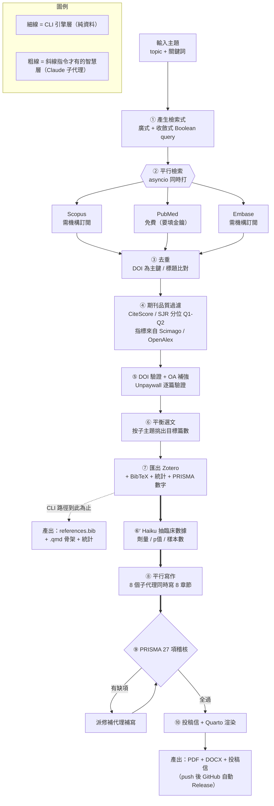

# 執行流程圖（繁體中文）

這套系統是「兩層」協作:

- **引擎層(細線)** — Python 套件 `litreview`,做確定性的資料工程(檢索、去重、品質過濾、DOI 驗證、統計、BibTeX)。對應 `lit-review review` CLI。
- **智慧層(粗線)** — Claude Code skill + 子代理,做需要判斷力的學術寫作(抽臨床數據、平行寫章節、PRISMA 稽核、投稿信、渲染)。只有 `/lit-review` 斜線指令會啟動。

## 兩種啟動方式

| 方式 | 跑到哪 | 產出 |
|---|---|---|
| `lit-review review "主題"`（CLI） | ①–⑦（只有引擎層） | `references.bib` + `.qmd` 骨架 + 統計 |
| `/lit-review "主題"`（Claude Code 斜線指令） | ①–⑩（引擎 + 智慧層全跑） | 可投稿的 PDF / DOCX + 投稿信 |
